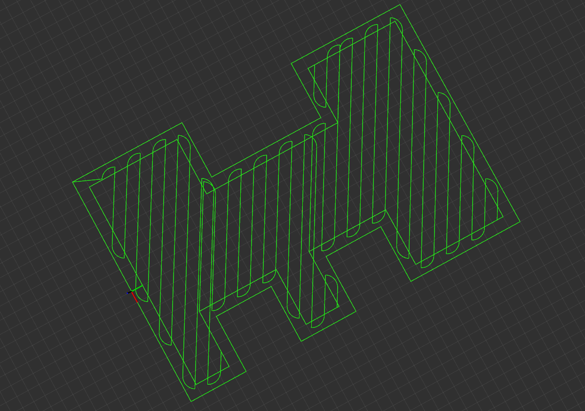

# Boustrophedon Planner
Boustrophedon Planner is a coverage path planner that implements a modified cellular decomposition algorithm. The original can be found [here](https://www.ncbi.nlm.nih.gov/pmc/articles/PMC6806237/).

## Overview
The path planner is an actionlib server that takes in a `geometry_msgs/PolygonStamped` and a `geometry_msgs/PoseStamped`,
and returns a `StripingPlan` message which contains a list of waypoints to stripe the passed in polygon.



## Changelog

- January 23, 2020:
  - The boustrophedon planner can now handle all types of simple polygons that it is given, both convex and concave.
  - Inner boundaries are supported, allowing the planner to create paths at a certain offset from the initial given boundary.
  - "Half - Y" turns are supported, allowing for some curvature at the start / end of paths to assist robots that are not      completely holonomic.
  - Many new launch file parameters allow the user to specify more precisely the behavior that they want the plan to have

## License

This repository is subject to GNU General Public License version 3 or later due to its dependencies.

The geometric operations rely on CGAL which is restricted by GNU General Public License version 3 or later.

## Errors: 
Make sure that the command: `rosdep install -y --from-paths src --ignore-src --rosdistro $ROS_DISTRO` is run to install the rosparam_shortcuts dependency
```sh
Errors     << boustrophedon_server:cmake /home/globotix/catkin_flexa/logs/boustrophedon_server/build.cmake.001.log                                                                                        
CMake Warning (dev) at CMakeLists.txt:2 (project):
  Policy CMP0048 is not set: project() command manages VERSION variables.
  Run "cmake --help-policy CMP0048" for policy details.  Use the cmake_policy
  command to set the policy and suppress this warning.

  The following variable(s) would be set to empty:

    CMAKE_PROJECT_VERSION
    CMAKE_PROJECT_VERSION_MAJOR
    CMAKE_PROJECT_VERSION_MINOR
    CMAKE_PROJECT_VERSION_PATCH
This warning is for project developers.  Use -Wno-dev to suppress it.

CMake Error at /opt/ros/noetic/share/catkin/cmake/catkinConfig.cmake:83 (find_package):
  Could not find a package configuration file provided by
  "rosparam_shortcuts" with any of the following names:

    rosparam_shortcutsConfig.cmake
    rosparam_shortcuts-config.cmake

  Add the installation prefix of "rosparam_shortcuts" to CMAKE_PREFIX_PATH or
  set "rosparam_shortcuts_DIR" to a directory containing one of the above
  files.  If "rosparam_shortcuts" provides a separate development package or
  SDK, be sure it has been installed.
Call Stack (most recent call first):
  CMakeLists.txt:6 (find_package)
```


Take note that the following error does not matter (for now):

```sh
executing command [sudo -H apt-get install -y ros-noetic-rosparam-shortcuts]
Reading package lists... Done
Building dependency tree       
Reading state information... Done
The following NEW packages will be installed:
  ros-noetic-rosparam-shortcuts
0 upgraded, 1 newly installed, 0 to remove and 635 not upgraded.
1 not fully installed or removed.
Need to get 42.7 kB of archives.
After this operation, 203 kB of additional disk space will be used.
Get:1 http://packages.ros.org/ros/ubuntu focal/main amd64 ros-noetic-rosparam-shortcuts amd64 0.4.0-1focal.20220106.234044 [42.7 kB]
Fetched 42.7 kB in 1s (36.9 kB/s)                        
Selecting previously unselected package ros-noetic-rosparam-shortcuts.
(Reading database ... 508400 files and directories currently installed.)
Preparing to unpack .../ros-noetic-rosparam-shortcuts_0.4.0-1focal.20220106.234044_amd64.deb ...
Unpacking ros-noetic-rosparam-shortcuts (0.4.0-1focal.20220106.234044) ...
Setting up ros-noetic-rosparam-shortcuts (0.4.0-1focal.20220106.234044) ...
Setting up jami-all (20220201.1741.98ba27e~dfsg1-1) ...
dpkg: error processing package jami-all (--configure):
 installed jami-all package post-installation script subprocess returned error exit status 1
Processing triggers for libc-bin (2.31-0ubuntu9.2) ...
Errors were encountered while processing:
 jami-all
E: Sub-process /usr/bin/dpkg returned an error code (1)
ERROR: the following rosdeps failed to install
  apt: command [sudo -H apt-get install -y ros-noetic-rosparam-shortcuts] failed

```
